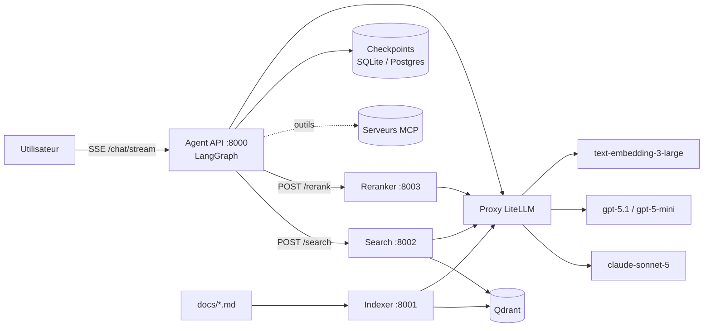
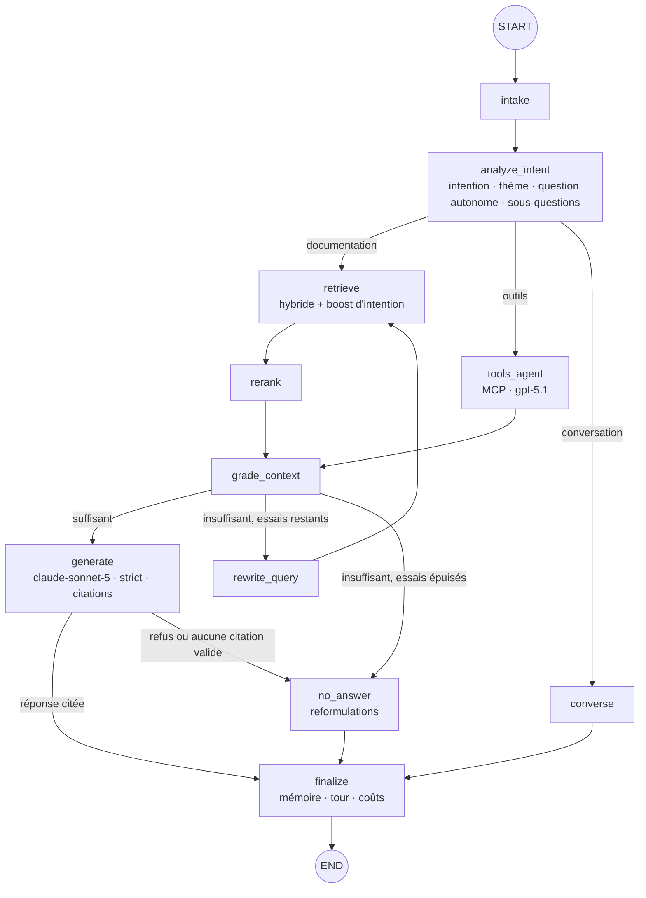

# Assistant O2S V4 — Agentic RAG

Assistant documentaire pour l'API O2S de Harvest. Il passe d'un RAG « classique » à un **RAG agentique** :
l'agent comprend d'abord l'intention de la question, choisit sa route, cherche, juge la qualité du contexte,
réessaie avec d'autres formulations si besoin, puis répond **uniquement** à partir des extraits retrouvés, en
français et avec citations. S'il ne trouve rien, il le dit explicitement et propose des reformulations.

| Brique | Choix |
|---|---|
| Orchestration agentique | LangGraph (graphe d'état, streaming, threads, checkpoints) |
| Modèles | via le proxy **LiteLLM** : `claude-sonnet-5` (réponse, profil des documents), `gpt-5.1` (outils MCP, juge d'éval), `gpt-5-mini` (intention, grading, réécriture, rerank, enrichissement), `text-embedding-3-large` |
| Base vectorielle | **Qdrant** uniquement — hybride dense (3072) + sparse BM25, fusion RRF |
| Architecture | Hexagonale (ports & adapters) |
| Services déployables | `indexer`, `search`, `reranker` (+ `agent`), un Dockerfile chacun |
| Mémoire | Checkpointer LangGraph (SQLite en local, Postgres en prod) + résumé glissant |
| Extensibilité | Port `ToolProviderPort` prêt pour les serveurs **MCP** |

---

## 1. Architecture

### 1.1 Vue d'ensemble



En local, l'agent peut aussi appeler search et rerank **en mémoire** (`SERVICES_MODE=local`) : même code,
adapters différents. C'est l'intérêt de l'hexagone.

### 1.2 Architecture hexagonale

```
src/o2s_rag/
├── domain/                 # Cœur métier pur (aucune dépendance technique)
│   ├── models.py           #   Chunk, Enrichment, QueryAnalysis, RetrievedChunk, Usage…
│   ├── prompts.py          #   Tous les prompts (FR), dont le prompt système strict
│   └── taxonomy.py         #   Intentions / thèmes partagés indexation ↔ recherche
├── ports/                  # Interfaces : LLMPort, EmbeddingPort, VectorStorePort, SearchPort,
│                           #   RerankPort, ChunkerPort, EnricherPort, ToolProviderPort…
├── application/            # Cas d'usage (ne dépendent que des ports)
│   ├── indexing_service.py #   indexation incrémentale
│   ├── search_service.py   #   recherche hybride + expansion parent
│   ├── rerank_service.py   #   reranking
│   └── agent/              #   graphe LangGraph : state, nodes, graph, service
├── adapters/
│   ├── inbound/            # Côté « pilotant » : HTTP (FastAPI ×4) et CLI
│   └── outbound/           # Côté « piloté » : LiteLLM, Qdrant, BM25, chunker, enrichisseur,
│                           #   clients HTTP des microservices, MCP, checkpointer
├── bootstrap/container.py  # Racine de composition : branche les adapters sur les ports
└── config.py               # Settings (variables d'environnement / .env)
```

Règle : `domain` ← `ports` ← `application` ← `adapters`. Changer de reranker, de LLM ou passer d'un appel
in-process à un appel HTTP se fait dans `bootstrap/`, sans toucher au cœur.

### 1.3 Le graphe agentique (LangGraph)



| Nœud | Rôle | Modèle |
|---|---|---|
| `intake` | Ouvre un nouveau tour, remet à zéro l'état du tour (pas la mémoire) | — |
| `analyze_intent` | Comprend la question **avant** de chercher : question autonome (résout « et pour la v2 ? » grâce à l'historique), intention de la taxonomie, thème, entités, sous-questions, route | gpt-5-mini |
| `retrieve` | Une recherche par (sous-)question, en parallèle ; à la 1re tentative les chunks de **même intention** sont boostés | embeddings |
| `rerank` | Rerank listwise 0–10, seuil `RERANK_MIN_SCORE`, top `RERANK_TOP_N` | gpt-5-mini |
| `grade_context` | Corrective RAG : le contexte permet-il de répondre ? | gpt-5-mini |
| `rewrite_query` | Nouvelles formulations (synonymes métier, noms d'endpoints…), sans boost d'intention | gpt-5-mini |
| `generate` | Réponse stricte, en français, citée `[S1]`, streamée token par token | claude-sonnet-5 |
| `no_answer` | « Je ne trouve pas de réponse dans le contexte qui m'est fourni. » + 2–3 reformulations + question de clarification | gpt-5-mini |
| `tools_agent` | Sous-agent MCP : appelle les outils, leurs résultats deviennent des sources | gpt-5.1 |
| `converse` | Salutations et questions sur la conversation elle-même, sans contenu technique | gpt-5-mini |
| `finalize` | Écrit le tour en mémoire (messages, cheminement, coûts), résumé glissant | gpt-5-mini |

**Garde-fous de fidélité**
1. Prompt système strict (voir `domain/prompts.py`) : source unique = `<contexte>`, citations obligatoires,
   phrase de refus exacte, réponse partielle explicite, français, résistance aux injections dans les documents.
2. Post-contrôle : une réponse **sans aucune citation valide** est rejetée (`answer_retracted`) et remplacée
   par le refus avec reformulations.
3. Boucle corrective bornée par `MAX_RETRIEVAL_ATTEMPTS` (2 par défaut, donc 3 recherches au maximum).

### 1.4 Indexation et metadata

**La base documentaire** (`docs/`) : 397 fichiers, **395 indexés** (2 pages vides exclues).

| Corpus | Fichiers | Source | `source_format` |
|---|---|---|---|
| `api_technique` | 6 contrats OpenAPI (`ref-*`) + 3 guides PDF « Documentation API O2S » (`guide-*`) | conversion .json / PDF | `openapi`, `pdf` |
| `aide_en_ligne` | 386 articles `help-NNN-*` d'o2s-help.harvest.fr, dont 149 fiches d'agrégation partenaire | scraping | `help_center` |

Aucun fichier n'a de frontmatter (il serait perdu à la prochaine conversion / au prochain scraping). Les
metadata de document viennent de 4 sources, par priorité croissante :

1. `config/documents.yaml` > `defaults` et `patterns` (famille de fichiers : corpus, format, public…) ;
2. **faits extraits du contenu** : URL source, numéro d'article, plan, liens internes (résolus en
   `links_to` / `linked_from`), vidéos, chemins de menus (`ui_paths`), produits cités, et pour les fiches
   d'agrégation : partenaire, format du code apporteur, produits agrégés, PAM transmis, fréquence… ;
3. **profil généré** `config/document_profiles.yaml` (`o2s-profile`) : titre propre, résumé, type de document,
   thème principal et secondaires, publics, produits, partenaire, tâches permises, questions auxquelles le
   document répond, mots-clés, synonymes, prérequis — rédigé par LLM (`MODEL_PROFILING`) et validé contre les
   vocabulaires de la taxonomie, ou heuristique hors-ligne ; versionné par l'empreinte du fichier ;
4. `config/documents.yaml` > `documents` : entrées curatées (9 documents d'API, exclusions, surcharges).

Le catalogue déclare aussi les **chapitres** des guides PDF, la **ressource** de chaque chemin d'API, les
**règles de sections** (`section_rules`, scopées par corpus) et des **indications par type de document**
(`doc_type_hints`) qui imposent ou suggèrent intention / thème / type de contenu (ex. RGPD →
`securite_conformite`, « Tableau de synthèse » → `disponibilite_champs`, question « Pourquoi … ? » de l'aide
→ `depannage`, fiche d'agrégation → `information_partenaire`). Modifier le catalogue ou un profil change
l'empreinte du document, qui est donc réindexé.

**Normalisation avant découpe** (selon `source_format`) :
- *PDF* (`normalizer.py`) : retrait des enveloppes ```` ```markdown ```` de chaque page, suivi des pages
  (`page_start` / `page_end`), titres parasites supprimés, hiérarchie reconstruite
  (`# API Contacts` > `## 2/ Tableau de synthèse` > `### personne/pieceIdentite`) ;
- *OpenAPI* (`normalizer.py`) : un endpoint devient une section `### GET /contacts`, un composant
  `### Schéma : Contact`, une question de FAQ `### FAQ : …` ;
- *Aide en ligne* (`help_center.py`) : le scraping a produit des articles sur une seule ligne, avec chaque
  passage recopié 2 à 4 fois, des « résidus » de mots en gras, des liens qui coupent les mots, un sommaire
  répété et des tableaux en TSV. Le parseur recolle les mots, retire doublons et résidus, reconstruit les
  intertitres (sommaire, questions « … ? », blocs encadrés d'espaces), les paragraphes et les tableaux, et
  garde chaque fiche d'agrégation en un seul chunk. Résultat : texte réduit à ~71 % (jusqu'à 10 %) sans perte
  de vocabulaire (couverture médiane 100 %, contrôle : `python -m evaluation.help_cleaning_report`).

Contrôle sans LLM ni Qdrant : `o2s-index --dry-run` affiche l'arbre et les metadata déterministes.

**Découpe hiérarchique** (`adapters/outbound/chunking/hierarchical_chunker.py`)

```
Document (nœud racine : plan + introduction)
└── Section H1/H2/H3 (texte complet de la section, ≤ 1800 tokens)
    ├── Chunk feuille (≤ 512 tokens, overlap 100)  ← recherché
    ├── Chunk feuille
    └── Sous-section …
```

- Les séparateurs `<!-- chunk -->`, `---`, `***` forcent une coupure ; les blocs de code et les tableaux
  ne sont jamais coupés s'ils tiennent dans un chunk.
- **Small-to-big** : on cherche sur les petits chunks, et si la section parente est courte
  (`PARENT_INLINE_MAX_TOKENS`), c'est elle qui est donnée au modèle. Deux chunks d'une même section ne
  produisent qu'une source.
- Les identifiants sont déterministes (UUID5) : réindexer donne les mêmes IDs.

**Metadata de chaque point Qdrant**

| Famille | Champs |
|---|---|
| Hiérarchie | `level` (document/section/chunk), `parent_id`, `children_ids`, `prev_id`, `next_id`, `root_id`, `depth`, `position`, `global_position`, `siblings_count` |
| Localisation | `doc_id`, `doc_title`, `source_path`, `source_url`, `heading`, `heading_path`, `breadcrumb`, `anchor`, `page_start`, `page_end` |
| Document (catalogue + profil) | `corpus`, `doc_type`, `source_format`, `language`, `api`, `api_name`, `api_version`, `resources`, `doc_theme`, `secondary_themes`, `doc_audiences`, `products`, `tags`, `doc_summary`, `user_tasks`, `partner`, `partner_facts`, `profile_source`, `content_hash`, `last_modified`, `text_hash` |
| Graphe | `related_docs` (curatés), `links_to`, `linked_from` (liens internes de l'aide en ligne) |
| Contexte de section | `section_kind` (endpoint, schema, question, fiche_partenaire, parametrage, tableau_synthese, rgpd…), `api_resource`, `chapter`, `endpoint` (« GET /contacts »), `shared` |
| Structure (regex + taxonomie) | `token_count`, `has_code`, `has_table`, `has_list`, `has_video`, `http_methods`, `endpoints`, `status_codes`, `parameters`, `urls`, `field_paths`, `enum_values` (O2S_API, O2S_LivretA…), `o2s_tabs`, `ui_paths` (« Services > Modules > Accueil et pilotage > Alertes »), `products`, `glossary_terms`, `glossary_expansions` |
| Sémantique (LLM) | `intent`, `theme`, `sub_theme`, `summary`, `keywords`, `hypothetical_questions`, `entities`, `content_type`, `audience` |

- Ordre d'enrichissement : annotation déterministe (`SectionAnnotator` : endpoint, ressource, règles du
  catalogue, produits et sigles cités), puis LLM — sections d'abord, puis chunks avec le résumé de leur
  section parente **et celui du document**. Les valeurs **imposées** par les règles priment sur sa sortie.
- Texte embarqué (*contextual retrieval*) = document, corpus / API + version, type de doc, partenaire,
  produits, **résumé du document**, fil d'Ariane, thème, intention, menus, résumé et questions hypothétiques du
  chunk, puis le contenu. Texte BM25 = fil d'Ariane + endpoint + partenaire + produits + mots-clés +
  **synonymes du profil** + **formes développées des sigles** (SRI → « indicateur de risque ») + endpoints,
  paramètres, chemins de champs, énumérations, menus + contenu.
- Les blocs communs recopiés dans chaque référence (RGPD, authentification, Problem) sont marqués `shared`
  et dédoublonnés à la recherche (`text_hash`).
- Index de payload Qdrant sur les champs ci-dessus (corpus, doc_type, partner, products, doc_theme,
  section_kind, ui_paths, glossary_terms…) et index plein texte multilingue sur `text`. `SearchFilters`
  accepte `corpus`, `doc_type(s)`, `partner`, `products`, `apis`, `theme`, `doc_ids` et le boost d'intention.
- **Recherche ciblée par l'agent** : en plus de la recherche générale, une requête restreinte à la fiche
  du partenaire nommé dans la question (annuaire construit sur les profils : « Swiss Life Banque » →
  fiche SwissLife Banque) et une requête restreinte au corpus détecté (`api_technique` / `aide_en_ligne`).
- Les citations indiquent l'API et sa version ou le lien de l'article d'aide, le type de document et les
  pages du PDF d'origine.
- **Incrémental** : un document dont l'empreinte n'a pas changé est ignoré, un document modifié est remplacé,
  un document supprimé du dossier est retiré de Qdrant.

**La taxonomie** (`config/taxonomy.yaml`) est le contrat entre indexation et recherche : chaque chunk reçoit
une intention, chaque question aussi, et la recherche fusionne (RRF) une liste filtrée par intention avec une
liste non filtrée (boost, pas filtre dur). Elle couvre les deux corpus : intentions des documents d'API
(`disponibilite_champs`, `correspondance_ihm`, `valeurs_autorisees`, `pagination_limites`…) et de l'aide en
ligne (`procedure_utilisateur`, `depannage`, `parametrage_configuration`, `information_partenaire`, `faq`…),
32 thèmes, et les **vocabulaires contrôlés** de niveau document : `corpora`, `doc_types` (15), `audiences`
(integrateur, conseiller, administrateur, assistant, client_final), `products` (O2S, MoneyPitch, Prisme,
Quantalys, Business Link… avec leurs alias) et un **glossaire** métier (KYC, SRI, DDA, LAB-FT, PAM, code
apporteur… avec leurs formes développées et synonymes).

### 1.5 Mémoire, threads et streaming

- Chaque conversation est un `thread_id`. L'état est persisté par le checkpointer après chaque nœud.
- Persistant sur le thread : `messages` (historique), `summary` (résumé glissant au-delà de
  `SUMMARIZE_AFTER_MESSAGES`), `turns` (pour **chaque question** : intention, question réécrite, statut,
  réponse, sources, tentatives, **trace nœud par nœud** avec durées, requêtes, scores, tokens et coût).
- Par tour : tout le reste, remis à zéro par `intake` (le cheminement d'une question ne se mélange pas avec
  celui de la précédente).
- Streaming SSE : `thread` → `node_start` / `node_end` (avec détails) → `token`… → `final`.

### 1.6 MCP (préparé)

Renseignez `config/mcp_servers.json` (format `langchain-mcp-adapters`) puis `ENABLE_MCP=true` :

```json
{
  "jira": {"transport": "streamable_http", "url": "http://localhost:9000/mcp"},
  "fs":   {"transport": "stdio", "command": "npx", "args": ["-y", "@modelcontextprotocol/server-filesystem", "/data"]}
}
```

Les outils sont annoncés au nœud d'intention (route `outils`), exécutés par `tools_agent`, et leurs résultats
passent par le même grading et le même générateur strict que la documentation. Ils sont donc cités comme
des sources.

---

## 2. Exécution en local

### 2.1 Prérequis

- Python 3.11+ et [uv](https://docs.astral.sh/uv/)
- Docker (pour Qdrant)
- Le proxy LiteLLM accessible, avec les 4 modèles déclarés

### 2.2 Installation

```powershell
# Windows (PowerShell). Sur macOS/Linux, remplacez `copy` par `cp`.
cd o2s-agentic-rag
uv venv
.venv\Scripts\activate
uv pip install -e ".[dev]"
copy .env.example .env      # puis renseignez LITELLM_BASE_URL et LITELLM_API_KEY
```

> Si le projet est dans OneDrive, ajoutez `$env:UV_LINK_MODE="copy"` pour éviter les erreurs de hardlink.

Vérifiez que les noms de modèles du `.env` correspondent aux `model_name` du `config.yaml` LiteLLM.

### 2.3 Démarrer Qdrant

```powershell
docker run -d --name qdrant -p 6333:6333 -v qdrant_data:/qdrant/storage qdrant/qdrant:v1.12.4
```

### 2.4 Indexer la documentation

1. Les 397 fichiers sont dans `docs/`. Un nouvel article d'aide `NNN_*.md` est pris en charge
   automatiquement (motif du catalogue) ; un nouveau document d'API se déclare dans `config/documents.yaml`.
2. Générez les profils de documents (une fois, puis seulement pour les documents nouveaux ou modifiés) :
   ```powershell
   o2s-profile --dry-run      # nombre de documents et tokens estimés
   o2s-profile                # profils LLM (MODEL_PROFILING) ; ~250 documents, les 149 fiches d'agrégation
                              # reçoivent un profil déterministe construit sur leurs faits
   o2s-profile --heuristic    # hors-ligne, sans LLM (profils de repli)
   ```
   Le résultat (`config/document_profiles.yaml`) est versionnable et relisible ; une valeur à corriger se
   surcharge dans `config/documents.yaml` > `documents`.
3. Contrôlez la découpe et les metadata sans appeler de LLM :
   ```powershell
   o2s-index --dry-run
   ```
4. Indexez (enrichissement LLM + embeddings + upsert) :
   ```powershell
   o2s-index            # incrémental
   o2s-index --force    # tout réindexer (après un changement de taxonomie ou de chunking)
   ```
   Le rapport affiche les documents traités, le nombre de nœuds, la durée, les tokens et le coût.
   Les nouveaux index de payload ne sont créés qu'à la création de la collection : après une mise à jour du
   schéma, supprimez la collection Qdrant (ou changez `QDRANT_COLLECTION`) avant `o2s-index --force`.

### 2.5 Discuter avec l'assistant

```powershell
o2s-chat --trace                 # streaming + cheminement nœud par nœud
o2s-chat --thread mon-thread     # reprendre une conversation (mémoire)
```

Commandes dans le chat : `/history` (tours et chemins du thread), `/new`, `/quit`.

### 2.6 API

```powershell
uvicorn o2s_rag.adapters.inbound.http.agent_app:app --port 8000
```

| Endpoint | Description |
|---|---|
| `POST /chat` | `{"question": "...", "thread_id": "optionnel"}` → réponse complète |
| `POST /chat/stream` | même corps, réponse en Server-Sent Events |
| `GET /threads/{id}` | messages, résumé, tours avec cheminement complet |
| `GET /threads/{id}/checkpoints` | checkpoints LangGraph bruts |

```powershell
curl -N -X POST http://localhost:8000/chat/stream -H "Content-Type: application/json" `
  -d '{"question": "Comment obtenir un jeton ?", "thread_id": "demo"}'
```

### 2.7 Stack complète en microservices (Docker)

```powershell
docker compose up -d --build
curl -X POST http://localhost:8001/index -H "Content-Type: application/json" -d '{"force": false}'
```

| Service | Dockerfile | Port | Extra installé |
|---|---|---|---|
| indexer | `services/indexer/Dockerfile` | 8001 | `indexer` (Qdrant, fastembed, tiktoken) |
| search | `services/search/Dockerfile` | 8002 | `search` (Qdrant, fastembed) |
| reranker | `services/reranker/Dockerfile` | 8003 | `reranker` (LLM ; `reranker-cross-encoder` en option) |
| agent | `services/agent/Dockerfile` | 8000 | `agent,postgres,mcp` |

Dans Docker, l'agent passe en `SERVICES_MODE=http`. Si LiteLLM tourne sur la machine hôte, utilisez
`LITELLM_BASE_URL=http://host.docker.internal:4000`.

---

## 3. Évaluation

```powershell
# 1. (optionnel) jeu « silver » généré depuis l'index, à relire
python -m evaluation.generate_dataset --n 60

# 2. évaluation
python -m evaluation.run_eval --dataset evaluation/datasets/silver.jsonl --tag baseline
python -m evaluation.run_eval --limit 10 --no-judge            # rapide, sans juge
```

Format d'une question (`evaluation/datasets/questions.jsonl`, modèle à compléter avec de vraies questions) :

```json
{"id": "q001", "question": "...", "answerable": true, "expected_intent": "authentification",
 "relevant": [{"doc_id": "authentification", "section": "jeton"}],
 "expected_keywords": ["access_token"], "reference_answer": "..."}
```

La vérité terrain est exprimée en `doc_id` + morceau de titre de section, et non en IDs de chunks : elle reste
valable si vous changez la taille des chunks.

| Famille | Métriques |
|---|---|
| Retrieval (recherche brute, union des tentatives, après rerank) | recall@1/3/5/10/20, precision@k, hit@k, nDCG@k, MRR |
| Reranking | gain Δ nDCG@5, Δ MRR, Δ precision@3 |
| Compréhension | accuracy de l'intention |
| Génération | couverture des mots-clés, taux de citation, précision des citations, taux de réponses en français |
| Juge LLM (`gpt-5.1`, différent du générateur) | fidélité au contexte, fidélité des citations, pertinence /5, exactitude /5 |
| Refus | accuracy, précision, rappel, taux de faux refus, hallucination sur questions hors périmètre |
| Agentique | tentatives moyennes, taux de réécriture, distribution des statuts et routes, chemins fréquents |
| Opérationnel | latence bout en bout (moyenne, p50, p90, p95, p99), TTFT, latence par nœud |
| Coûts | total, par question (moyenne, p95), projection pour 1 000 questions, par modèle, par opération, coût du juge |

Les sorties vont dans `evaluation/results/<date>-<tag>/` : `per_question.jsonl`, `summary.json` et
`report.md`, qui liste aussi les 5 questions au plus faible recall à investiguer.

**Coûts** : l'adapter lit le coût réel dans l'en-tête `x-litellm-response-cost` du proxy. À défaut (streaming),
il l'estime avec `config/pricing.yaml`. Vérifiez ces prix avec votre grille.

---

## 4. Tests

```powershell
pytest -q
```

Les tests n'appellent aucun service externe :
- chunker : arbre, liens parent/enfant/précédent/suivant, séparateurs, extraction des endpoints et codes ;
- indexation incrémentale et recherche avec boost d'intention et expansion parent sur un Qdrant embarqué ;
- adapter LiteLLM contre un faux proxy (coût lu dans l'en-tête, JSON, streaming) ;
- graphe complet avec des adapters factices : réponse citée, refus après réessais avec reformulations,
  rejet d'une réponse non citée, mémoire multi-tours et route conversation ;
- métriques d'évaluation.

---

## 5. Réglages principaux (`.env`)

| Variable | Défaut | Effet |
|---|---|---|
| `LITELLM_BASE_URL` / `LITELLM_API_KEY` | — | Proxy LiteLLM (alias acceptés : `OPENAI_BASE_URL`, `LITELLM_URL`, `OPENAI_API_KEY` ; « /v1 » ajouté) ; fichier `.env` ou `env` |
| `MODEL_GENERATION` / `MODEL_PROFILING` | claude-sonnet-5 | Réponse finale / profils de documents |
| `MODEL_FAST` / `MODEL_REASONING` | gpt-5-mini / gpt-5.1 | Intention, grading, rerank, enrichissement / outils, juge |
| `CHUNK_SIZE` / `CHUNK_OVERLAP` | 512 / 100 | Taille des chunks feuilles |
| `PARENT_HEADING_LEVELS` | 3 | Titres H1..Hn qui deviennent des sections |
| `ENABLE_SPARSE` | true | Recherche hybride BM25 + dense |
| `SEARCH_TOP_K` | 20 | Candidats par requête avant rerank |
| `RERANK_TOP_N` / `RERANK_MIN_SCORE` | 6 / 0.35 | Chunks gardés pour la génération |
| `RERANKER_BACKEND` | llm | `llm` (gpt-5-mini) ou `cross-encoder` (local) |
| `CONTEXT_STRATEGY` | parent_if_small | Utiliser la section parente quand elle est courte |
| `MAX_RETRIEVAL_ATTEMPTS` | 2 | Réécritures avant « pas de réponse » |
| `HISTORY_WINDOW` | 10 | Messages récents injectés dans les prompts |
| `CHECKPOINTER` | sqlite | `sqlite`, `postgres` (prod) ou `memory` |
| `SERVICES_MODE` | local | `local` (in-process) ou `http` (microservices) |

## 6. Pistes suivantes

- Construire un jeu **gold** de 50 à 100 questions validées par les équipes O2S (la base de toute décision de réglage).
- Ajuster la taxonomie après une première évaluation (matrice intention attendue / détectée).
- Comparer `RERANKER_BACKEND=llm` et `cross-encoder` sur le couple coût / latence / nDCG.
- Authentification de l'API agent et observabilité (Langfuse ou OpenTelemetry) avant la mise en production.
