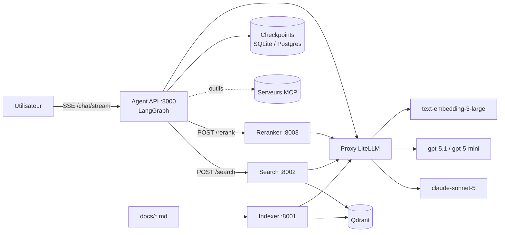
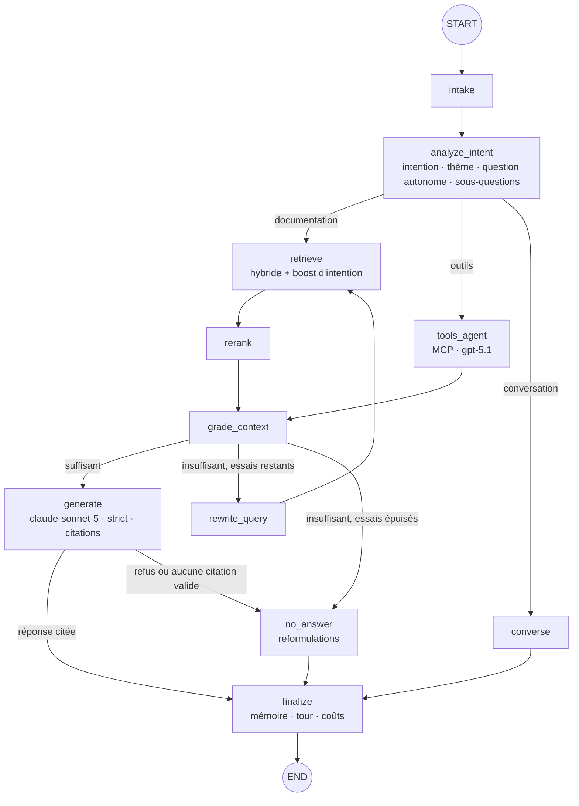

# Assistant O2S V4 — Agentic RAG

Assistant documentaire pour l'API O2S de Harvest. Il passe d'un RAG « classique » à un **RAG agentique** :
l'agent comprend d'abord l'intention de la question, choisit sa route, cherche, juge la qualité du contexte,
réessaie avec d'autres formulations si besoin, puis répond **uniquement** à partir des extraits retrouvés, en
français et avec citations. S'il ne trouve rien, il le dit explicitement et propose des reformulations.

| Brique | Choix |
|---|---|
| Orchestration agentique | LangGraph (graphe d'état, streaming, threads, checkpoints) |
| Modèles | via le proxy **LiteLLM** : `claude-sonnet-5` (réponse, profil des documents), `gpt-5.1` (outils MCP, juge d'éval), `gpt-5-mini` (intention, grading, réécriture, rerank, enrichissement), `text-embedding-3-large` |
| Base vectorielle | **Qdrant** uniquement — hybride dense (3072) + sparse BM25, fusion RRF |
| Architecture | Hexagonale (ports & adapters) |
| Services déployables | `indexer`, `search`, `reranker` (+ `agent`), un Dockerfile chacun |
| Mémoire | Checkpointer LangGraph (SQLite en local, Postgres en prod) + résumé glissant |
| Extensibilité | Port `ToolProviderPort` prêt pour les serveurs **MCP** |

---

## 1. Architecture

### 1.1 Vue d'ensemble



En local, l'agent peut aussi appeler search et rerank **en mémoire** (`SERVICES_MODE=local`) : même code,
adapters différents. C'est l'intérêt de l'hexagone.

### 1.2 Architecture hexagonale

```
src/o2s_rag/
├── domain/                 # Cœur métier pur (aucune dépendance technique)
│   ├── models.py           #   Chunk, Enrichment, QueryAnalysis, RetrievedChunk, Usage…
│   ├── prompts.py          #   Tous les prompts (FR), dont le prompt système strict
│   └── taxonomy.py         #   Intentions / thèmes partagés indexation ↔ recherche
├── ports/                  # Interfaces : LLMPort, EmbeddingPort, VectorStorePort, SearchPort,
│                           #   RerankPort, ChunkerPort, EnricherPort, ToolProviderPort…
├── application/            # Cas d'usage (ne dépendent que des ports)
│   ├── indexing_service.py #   indexation incrémentale
│   ├── search_service.py   #   recherche hybride + expansion parent
│   ├── rerank_service.py   #   reranking
│   └── agent/              #   graphe LangGraph : state, nodes, graph, service
├── adapters/
│   ├── inbound/            # Côté « pilotant » : HTTP (FastAPI ×4) et CLI
│   └── outbound/           # Côté « piloté » : LiteLLM, Qdrant, BM25, chunker, enrichisseur,
│                           #   clients HTTP des microservices, MCP, checkpointer
├── bootstrap/container.py  # Racine de composition : branche les adapters sur les ports
└── config.py               # Settings (variables d'environnement / .env)
```

Règle : `domain` ← `ports` ← `application` ← `adapters`. Changer de reranker, de LLM ou passer d'un appel
in-process à un appel HTTP se fait dans `bootstrap/`, sans toucher au cœur.

### 1.3 Le graphe agentique (LangGraph)



| Nœud | Rôle | Modèle |
|---|---|---|
| `intake` | Ouvre un nouveau tour, remet à zéro l'état du tour (pas la mémoire) | — |
| `analyze_intent` | Comprend la question **avant** de chercher : question autonome (résout « et pour la v2 ? » grâce à l'historique), intention de la taxonomie, thème, entités, sous-questions, route | gpt-5-mini |
| `retrieve` | Une recherche par (sous-)question, en parallèle ; à la 1re tentative les chunks de **même intention** sont boostés | embeddings |
| `rerank` | Rerank listwise 0–10, seuil `RERANK_MIN_SCORE`, top `RERANK_TOP_N` | gpt-5-mini |
| `grade_context` | Corrective RAG : le contexte permet-il de répondre ? | gpt-5-mini |
| `rewrite_query` | Nouvelles formulations (synonymes métier, noms d'endpoints…), sans boost d'intention | gpt-5-mini |
| `generate` | Réponse stricte, en français, citée `[S1]`, streamée token par token | claude-sonnet-5 |
| `no_answer` | « Je ne trouve pas de réponse dans le contexte qui m'est fourni. » + 2–3 reformulations + question de clarification | gpt-5-mini |
| `tools_agent` | Sous-agent MCP : appelle les outils, leurs résultats deviennent des sources | gpt-5.1 |
| `converse` | Salutations et questions sur la conversation elle-même, sans contenu technique | gpt-5-mini |
| `finalize` | Écrit le tour en mémoire (messages, cheminement, coûts), résumé glissant | gpt-5-mini |

**Garde-fous de fidélité**
1. Prompt système strict (voir `domain/prompts.py`) : source unique = `<contexte>`, citations obligatoires,
   phrase de refus exacte, réponse partielle explicite, français, résistance aux injections dans les documents.
2. Post-contrôle : une réponse **sans aucune citation valide** est rejetée (`answer_retracted`) et remplacée
   par le refus avec reformulations.
3. Boucle corrective bornée par `MAX_RETRIEVAL_ATTEMPTS` (2 par défaut, donc 3 recherches au maximum).

### 1.4 Indexation et metadata

**La base documentaire** (`docs/`) : **395 documents indexés**.

| Corpus | Fichiers | Source | `source_format` |
|---|---|---|---|
| `api_technique` | 6 contrats OpenAPI (`ref-*`) + 3 guides PDF « Documentation API O2S » (`guide-*`), `docs/Harvest API - *.md` | conversion .json / PDF | `openapi`, `pdf` |
| `aide_en_ligne` | 386 documents `docs/aide_en_ligne/` générés par `o2s-build-docs` depuis l'export WordPress `sources/aide_en_ligne.csv` | export CSV | `markdown` |

**Base de l'aide en ligne** (`o2s-build-docs`, `adapters/outbound/loaders/help_export.py`) : l'export
(388 lignes : produit, post_id, titre, lien, date, statut, contenu, catégories, thématique) est reconstruit
en un fichier Markdown par article, métadonnées en frontmatter YAML :

| Fichiers | Nombre | Contenu |
|---|---|---|
| `aide-<post_id>-<slug>.md` | 213 | articles O2S / MoneyPitch / migration Prisme (procédures, présentations, FAQ, tutoriels) |
| `faq-prisme-<post_id>-<slug>.md` | 17 | sections de la FAQ de migration Prisme → O2S (même page, une section par fichier) |
| `agregation-<partenaire>.md` | 149 | fiches d'agrégation partenaire (code apporteur, produits, PAM, mouvements, fréquence) |
| `diagnostic-agregation-<slug>.md` | 7 | fiches de diagnostic (valorisation erronée, mouvements manquants… : hypothèses, actions, glossaire) |

Les 2 lignes vides de l'export (« test », « Partenaires » : « A developper ») sont ignorées. Le contenu de
l'export est le texte des pages aplati, très bruité ; le générateur :
- retire les **répétitions** (blocs recopiés 2 à 4 fois pour les versions desktop / mobile, onglets,
  accordéons) et les **résidus** (mots en gras ré-extraits après chaque bloc) ;
- reconstruit les **intertitres** à partir des indices de la mise en page aplatie : titre d'onglet
  (« Budget. Budget Présente… »), titre d'étape suivi d'un bloc répété, intertitre nominal
  (« Ajout d’un bien immobilier. »), question de FAQ (« Comment … ?. »), plan (« Sommaire … (#ancre) ») ;
- reconstruit les **tableaux** (lignes TSV aux cellules sans espaces, recollées d'après le texte) ; un
  tableau « zone | description longue » devient une sous-section par ligne ;
- écrit le frontmatter : `doc_id`, titre, URL source, produits, thématique, type quand il est certain (FAQ,
  tutoriel, fiche partenaire, diagnostic, migration), liens internes et externes, vidéos, faits du
  partenaire, identifiants WordPress (`wp_post_id`, `wp_categories`, `wp_statut`), date de modification.

Résultat : 3,9 → 2,0 millions de caractères, 82 % des chunks rattachés à un intertitre précis, et un
**contrôle de perte** (tout mot du texte brut doit se retrouver dans le texte nettoyé) consigné dans
`sources/build_report.json` : 80 mots absents sur 386 documents, essentiellement des traductions
italiennes / anglaises de la liste Quantalys et des identifiants de vidéos. Pour mettre à jour la base :
remplacer `sources/aide_en_ligne.csv` par un nouvel export, puis `o2s-build-docs`, `o2s-profile`, `o2s-index`.

Les metadata de document viennent de 4 sources, par priorité croissante :

1. `config/documents.yaml` > `defaults` et `patterns` (famille de fichiers : corpus, format, public…) ;
2. **faits extraits du contenu** : URL source, numéro d'article, plan, liens internes (résolus en
   `links_to` / `linked_from`), vidéos, chemins de menus (`ui_paths`), produits cités, et pour les fiches
   d'agrégation : partenaire, format du code apporteur, produits agrégés, PAM transmis, fréquence… ;
3. **profil généré** `config/document_profiles.yaml` (`o2s-profile`) : titre propre, résumé, type de document,
   thème principal et secondaires, publics, produits, partenaire, tâches permises, questions auxquelles le
   document répond, mots-clés, synonymes, prérequis — rédigé par LLM (`MODEL_PROFILING`) et validé contre les
   vocabulaires de la taxonomie, ou heuristique hors-ligne ; versionné par l'empreinte du fichier ;
4. `config/documents.yaml` > `documents` : entrées curatées (9 documents d'API, exclusions, surcharges).

Le catalogue déclare aussi les **chapitres** des guides PDF, la **ressource** de chaque chemin d'API, les
**règles de sections** (`section_rules`, scopées par corpus) et des **indications par type de document**
(`doc_type_hints`) qui imposent ou suggèrent intention / thème / type de contenu (ex. RGPD →
`securite_conformite`, « Tableau de synthèse » → `disponibilite_champs`, question « Pourquoi … ? » de l'aide
→ `depannage`, fiche d'agrégation → `information_partenaire`). Modifier le catalogue ou un profil change
l'empreinte du document, qui est donc réindexé.

**Normalisation avant découpe** (selon `source_format`) :
- *PDF* (`normalizer.py`) : retrait des enveloppes ```` ```markdown ```` de chaque page, suivi des pages
  (`page_start` / `page_end`), titres parasites supprimés, hiérarchie reconstruite
  (`# API Contacts` > `## 2/ Tableau de synthèse` > `### personne/pieceIdentite`) ;
- *OpenAPI* (`normalizer.py`) : un endpoint devient une section `### GET /contacts`, un composant
  `### Schéma : Contact`, une question de FAQ `### FAQ : …` ;
- *Aide en ligne* : déjà nettoyée et structurée par `o2s-build-docs` (voir ci-dessus) ; chargée telle quelle
  (`markdown`). Chaque fiche d'agrégation reste un seul chunk (intertitres en H4). L'ancien parseur
  `help_center.py` (`source_format: help_center`) reste disponible pour des pages scrapées une à une.

Contrôle sans LLM ni Qdrant : `o2s-index --dry-run` affiche l'arbre et les metadata déterministes.

**Découpe hiérarchique** (`adapters/outbound/chunking/hierarchical_chunker.py`)

```
Document (nœud racine : plan + introduction)
└── Section H1/H2/H3 (texte complet de la section, ≤ 1800 tokens)
    ├── Chunk feuille (≤ 512 tokens, overlap 100)  ← recherché
    ├── Chunk feuille
    └── Sous-section …
```

- Les séparateurs `<!-- chunk -->`, `---`, `***` forcent une coupure ; les blocs de code et les tableaux
  ne sont jamais coupés s'ils tiennent dans un chunk.
- **Small-to-big** : on cherche sur les petits chunks, et si la section parente est courte
  (`PARENT_INLINE_MAX_TOKENS`), c'est elle qui est donnée au modèle. Deux chunks d'une même section ne
  produisent qu'une source.
- Les identifiants sont déterministes (UUID5) : réindexer donne les mêmes IDs.

**Metadata de chaque point Qdrant**

| Famille | Champs |
|---|---|
| Hiérarchie | `level` (document/section/chunk), `parent_id`, `children_ids`, `prev_id`, `next_id`, `root_id`, `depth`, `position`, `global_position`, `siblings_count` |
| Localisation | `doc_id`, `doc_title`, `source_path`, `source_url`, `heading`, `heading_path`, `breadcrumb`, `anchor`, `page_start`, `page_end` |
| Document (catalogue + profil) | `corpus`, `doc_type`, `source_format`, `language`, `api`, `api_name`, `api_version`, `resources`, `doc_theme`, `secondary_themes`, `doc_audiences`, `products`, `tags`, `doc_summary`, `user_tasks`, `partner`, `partner_facts`, `profile_source`, `content_hash`, `last_modified`, `text_hash` |
| Graphe | `related_docs` (curatés), `links_to`, `linked_from` (liens internes de l'aide en ligne) |
| Contexte de section | `section_kind` (endpoint, schema, question, fiche_partenaire, parametrage, tableau_synthese, rgpd…), `api_resource`, `chapter`, `endpoint` (« GET /contacts »), `shared` |
| Structure (regex + taxonomie) | `token_count`, `has_code`, `has_table`, `has_list`, `has_video`, `http_methods`, `endpoints`, `status_codes`, `parameters`, `urls`, `field_paths`, `enum_values` (O2S_API, O2S_LivretA…), `o2s_tabs`, `ui_paths` (« Services > Modules > Accueil et pilotage > Alertes »), `products`, `glossary_terms`, `glossary_expansions` |
| Sémantique (LLM) | `intent`, `theme`, `sub_theme`, `summary`, `keywords`, `hypothetical_questions`, `entities`, `content_type`, `audience` |

- Ordre d'enrichissement : annotation déterministe (`SectionAnnotator` : endpoint, ressource, règles du
  catalogue, produits et sigles cités), puis LLM — sections d'abord, puis chunks avec le résumé de leur
  section parente **et celui du document**. Les valeurs **imposées** par les règles priment sur sa sortie.
- Texte embarqué (*contextual retrieval*) = document, corpus / API + version, type de doc, partenaire,
  produits, **résumé du document**, fil d'Ariane, thème, intention, menus, résumé et questions hypothétiques du
  chunk, puis le contenu. Texte BM25 = fil d'Ariane + endpoint + partenaire + produits + mots-clés +
  **synonymes du profil** + **formes développées des sigles** (SRI → « indicateur de risque ») + endpoints,
  paramètres, chemins de champs, énumérations, menus + contenu.
- Les blocs communs recopiés dans chaque référence (RGPD, authentification, Problem) sont marqués `shared`
  et dédoublonnés à la recherche (`text_hash`).
- Index de payload Qdrant sur les champs ci-dessus (corpus, doc_type, partner, products, doc_theme,
  section_kind, ui_paths, glossary_terms…) et index plein texte multilingue sur `text`. `SearchFilters`
  accepte `corpus`, `doc_type(s)`, `partner`, `products`, `apis`, `theme`, `doc_ids` et le boost d'intention.
- **Recherche ciblée par l'agent** : en plus de la recherche générale, une requête restreinte à la fiche
  du partenaire nommé dans la question (annuaire construit sur les profils : « Swiss Life Banque » →
  fiche SwissLife Banque) et une requête restreinte au corpus détecté (`api_technique` / `aide_en_ligne`).
- Les citations indiquent l'API et sa version ou le lien de l'article d'aide, le type de document et les
  pages du PDF d'origine.
- **Incrémental** : un document dont l'empreinte n'a pas changé est ignoré, un document modifié est remplacé,
  un document supprimé du dossier est retiré de Qdrant.

**La taxonomie** (`config/taxonomy.yaml`) est le contrat entre indexation et recherche : chaque chunk reçoit
une intention, chaque question aussi, et la recherche fusionne (RRF) une liste filtrée par intention avec une
liste non filtrée (boost, pas filtre dur). Elle couvre les deux corpus : intentions des documents d'API
(`disponibilite_champs`, `correspondance_ihm`, `valeurs_autorisees`, `pagination_limites`…) et de l'aide en
ligne (`procedure_utilisateur`, `depannage`, `parametrage_configuration`, `information_partenaire`, `faq`…),
32 thèmes, et les **vocabulaires contrôlés** de niveau document : `corpora`, `doc_types` (15), `audiences`
(integrateur, conseiller, administrateur, assistant, client_final), `products` (O2S, MoneyPitch, Prisme,
Quantalys, Business Link… avec leurs alias) et un **glossaire** métier (KYC, SRI, DDA, LAB-FT, PAM, code
apporteur… avec leurs formes développées et synonymes).

### 1.5 Mémoire, threads et streaming

- Chaque conversation est un `thread_id`. L'état est persisté par le checkpointer après chaque nœud.
- Persistant sur le thread : `messages` (historique), `summary` (résumé glissant au-delà de
  `SUMMARIZE_AFTER_MESSAGES`), `turns` (pour **chaque question** : intention, question réécrite, statut,
  réponse, sources, tentatives, **trace nœud par nœud** avec durées, requêtes, scores, tokens et coût).
- Par tour : tout le reste, remis à zéro par `intake` (le cheminement d'une question ne se mélange pas avec
  celui de la précédente).
- Streaming SSE : `thread` → `node_start` / `node_end` (avec détails) → `token`… → `final`.

### 1.6 MCP (préparé)

Renseignez `config/mcp_servers.json` (format `langchain-mcp-adapters`) puis `ENABLE_MCP=true` :

```json
{
  "jira": {"transport": "streamable_http", "url": "http://localhost:9000/mcp"},
  "fs":   {"transport": "stdio", "command": "npx", "args": ["-y", "@modelcontextprotocol/server-filesystem", "/data"]}
}
```

Les outils sont annoncés au nœud d'intention (route `outils`), exécutés par `tools_agent`, et leurs résultats
passent par le même grading et le même générateur strict que la documentation. Ils sont donc cités comme
des sources.

---

## 2. Exécution en local

### 2.1 Prérequis

- Python 3.11+ et [uv](https://docs.astral.sh/uv/)
- Docker (pour Qdrant)
- Le proxy LiteLLM accessible, avec les 4 modèles déclarés

### 2.2 Installation

```powershell
# Windows (PowerShell). Sur macOS/Linux, remplacez `copy` par `cp`.
cd o2s-agentic-rag
uv venv
.venv\Scripts\activate
uv pip install -e ".[dev]"
copy .env.example .env      # puis renseignez LITELLM_BASE_URL et LITELLM_API_KEY
```

> Si le projet est dans OneDrive, ajoutez `$env:UV_LINK_MODE="copy"` pour éviter les erreurs de hardlink.

Vérifiez que les noms de modèles du `.env` correspondent aux `model_name` du `config.yaml` LiteLLM.

### 2.3 Démarrer Qdrant

```powershell
docker run -d --name qdrant -p 6333:6333 -v qdrant_data:/qdrant/storage qdrant/qdrant:v1.12.4
```

### 2.4 Indexer la documentation

1. Les documents sont dans `docs/`. L'aide en ligne se (re)génère depuis l'export CSV :
   ```powershell
   o2s-build-docs             # sources/aide_en_ligne.csv -> docs/aide_en_ligne/ (+ sources/build_report.json)
   ```
   Un nouveau document d'API se déclare dans `config/documents.yaml`.
2. Générez les profils de documents (une fois, puis seulement pour les documents nouveaux ou modifiés) :
   ```powershell
   o2s-profile --dry-run      # nombre de documents et tokens estimés
   o2s-profile                # profils LLM (MODEL_PROFILING) ; ~250 documents, les 149 fiches d'agrégation
                              # reçoivent un profil déterministe construit sur leurs faits
   o2s-profile --heuristic    # hors-ligne, sans LLM (profils de repli)
   ```
   Le résultat (`config/document_profiles.yaml`) est versionnable et relisible ; une valeur à corriger se
   surcharge dans `config/documents.yaml` > `documents`.
3. Contrôlez la découpe et les metadata sans appeler de LLM :
   ```powershell
   o2s-index --dry-run
   ```
4. Indexez (enrichissement LLM + embeddings + upsert) :
   ```powershell
   o2s-index            # incrémental
   o2s-index --force    # tout réindexer (après un changement de taxonomie ou de chunking)
   ```
   Le rapport affiche les documents traités, le nombre de nœuds, la durée, les tokens et le coût.
   Les nouveaux index de payload ne sont créés qu'à la création de la collection : après une mise à jour du
   schéma, supprimez la collection Qdrant (ou changez `QDRANT_COLLECTION`) avant `o2s-index --force`.

   **Cache local** (`data/cache/llm_cache.sqlite`, `LLM_CACHE_ENABLED=true` par défaut) : les réponses
   d'enrichissement, de profilage, d'intention, de rerank et les embeddings sont mémorisés par empreinte
   (modèle + prompt + contenu). Un chunk inchangé ne coûte donc plus rien, même avec `--force` ou après une
   suppression de la collection ; le rapport affiche les hits / misses dans `cache`. Pour forcer de nouveaux
   appels (ex. `o2s-profile --force` pour régénérer des profils avec le même prompt), ajoutez `--no-cache`.
   Supprimer le fichier vide le cache. La génération des réponses de l'agent n'est jamais mise en cache.

   **BM25 hors-ligne** : la liste de mots vides français utilisée par la recherche hybride est fournie dans
   `config/bm25/french.txt` (liste Snowball), aucun téléchargement depuis Hugging Face n'est nécessaire.
   Derrière un proxy d'entreprise qui réécrit les certificats, `SSL_VERIFY=false` dans `.env` désactive la
   vérification TLS (poste de dev uniquement).

### 2.5 Discuter avec l'assistant

```powershell
o2s-chat --trace                 # streaming + cheminement nœud par nœud
o2s-chat --thread mon-thread     # reprendre une conversation (mémoire)
```

Commandes dans le chat : `/history` (tours et chemins du thread), `/new`, `/quit`.

### 2.6 API

```powershell
uvicorn o2s_rag.adapters.inbound.http.agent_app:app --port 8000
```

| Endpoint | Description |
|---|---|
| `POST /chat` | `{"question": "...", "thread_id": "optionnel"}` → réponse complète |
| `POST /chat/stream` | même corps, réponse en Server-Sent Events |
| `GET /threads/{id}` | messages, résumé, tours avec cheminement complet |
| `DELETE /threads/{id}` | supprime la mémoire du thread (utilisé par le frontend) |
| `GET /threads/{id}/checkpoints` | checkpoints LangGraph bruts |

```powershell
curl -N -X POST http://localhost:8000/chat/stream -H "Content-Type: application/json" `
  -d '{"question": "Comment obtenir un jeton ?", "thread_id": "demo"}'
```

### 2.7 Stack complète en microservices (Docker)

```powershell
docker compose up -d --build
curl -X POST http://localhost:8001/index -H "Content-Type: application/json" -d '{"force": false}'
```

| Service | Dockerfile | Port | Extra installé |
|---|---|---|---|
| indexer | `services/indexer/Dockerfile` | 8001 | `indexer` (Qdrant, fastembed, tiktoken) |
| search | `services/search/Dockerfile` | 8002 | `search` (Qdrant, fastembed) |
| reranker | `services/reranker/Dockerfile` | 8003 | `reranker` (LLM ; `reranker-cross-encoder` en option) |
| agent | `services/agent/Dockerfile` | 8000 | `agent,postgres,mcp` |
| frontend | `frontend/Dockerfile` | 4200 | Angular compilé, servi par nginx (`/api` → agent) |

Dans Docker, l'agent passe en `SERVICES_MODE=http`. Si LiteLLM tourne sur la machine hôte, utilisez
`LITELLM_BASE_URL=http://host.docker.internal:4000`.

### 2.8 Interface web (Angular)

Le dossier `frontend/` contient l'interface de l'assistant (Angular 22, charte Harvest : bleu nuit
`#012233`, vert `#33EE87`, police Poppins) :

- **discussion en streaming** : la réponse s'écrit token par token, comme dans `o2s-chat` ;
- **raisonnement en direct** : chaque étape du graphe (intention, recherche, rerank, évaluation du
  contexte, reformulation, rédaction) s'affiche au fil du flux, avec ses détails et sa durée ;
- **historique à gauche** : conversations sauvegardées dans le navigateur, recherche dans les questions
  posées (sans tenir compte des accents), suppression (efface aussi la mémoire du thread côté API) ;
- **sommaire à droite** : titres de la réponse et documents trouvés, regroupés par grands titres, pour
  naviguer dans le résultat ; les citations `[S1]` mènent à la carte de la source.

```powershell
uvicorn o2s_rag.adapters.inbound.http.agent_app:app --port 8000   # API agent
cd frontend
npm install
npm start                                                         # http://localhost:4200
```

Node.js 22.22.3+ ou 24.15+ est requis. En développement, `ng serve` relaie `/api` vers
`http://localhost:8000` (`frontend/proxy.conf.json`) ; en Docker, c'est nginx. Couleurs et polices de
la charte sont regroupées dans `frontend/src/styles/_harvest-theme.scss`. Détails :
[`frontend/README.md`](frontend/README.md).

---

## 3. Évaluation

### Jeu de test métier (par défaut)

`evaluation/datasets/questions_tests.csv` : 125 questions O2S avec leur **réponse idéale validée par le
métier** (colonnes `produit`, `requete`, `reponse_ideale`, `liens_possibles`, `thematique`). Les réponses sont
utilisées telles quelles comme vérité terrain et ne doivent jamais être modifiées. Les liens possibles
(plusieurs séparés par `;`) sont rattachés aux documents du corpus par leur URL source.

```powershell
python -m evaluation.run_eval --tag baseline                 # 125 questions, juge LLM, coûts et latences réels
python -m evaluation.run_eval --limit 10 --no-judge          # rapide, sans juge
python -m evaluation.run_eval --concurrency 1                # latences sans contention (mesure « 1 utilisateur »)
```

Le cache LLM est désactivé pendant l'évaluation, pour mesurer les coûts et latences réels (`--use-cache`
pour le réactiver lors d'itérations rapides).

### Évaluation avec promptfoo

`promptfooconfig.yaml` (racine) évalue l'agent sur les 125 questions du jeu métier, via l'API
(`POST /chat` avec `include_context: true`, qui renvoie aussi les extraits fournis au modèle et le
journal de recherche). Le fichier est **généré** depuis le CSV : modifiez le générateur, pas le YAML.

```powershell
uvicorn o2s_rag.adapters.inbound.http.agent_app:app --port 8000     # API agent
python -m evaluation.promptfoo.build_config                         # (re)génère promptfooconfig.yaml
npx promptfoo@latest eval --no-cache                                # 125 questions
npx promptfoo@latest eval --no-cache --filter-first-n 5             # essai rapide
npx promptfoo@latest view                                           # tableau de bord
```

Le juge (`gpt-5.1`) et les embeddings passent par LiteLLM avec `LITELLM_BASE_URL` / `LITELLM_API_KEY`,
lus dans `.env` : aucune clé dans le fichier. `--no-cache` est indispensable pour mesurer les vraies
latences et les vrais coûts (promptfoo met sinon les réponses en cache). Les métriques de recherche sont
calculées en Python (`python` sur le PATH, ou `PROMPTFOO_PYTHON`). Rapports :
`evaluation/results/promptfoo/latest.{json,html}`.

| Métrique (promptfoo) | Type | Rôle |
|---|---|---|
| Taux de réponse | `not-icontains` | notée : l'agent ne refuse pas de répondre |
| Faithfulness | `context-faithfulness` (≥ 0,7) | notée : chaque affirmation est soutenue par les extraits fournis |
| Answer relevancy | `answer-relevance` (≥ 0,5) | notée : la réponse traite la question |
| Completeness | `llm-rubric` (≥ 0,7) | notée : part des informations clés de la réponse métier présentes |
| Exactitude | `factuality` | notée : pas de contradiction avec la réponse métier |
| Context relevance / Context recall | `context-relevance` / `context-recall` | diagnostic : qualité du contexte retrouvé |
| Similarité sémantique | `similar` (embeddings) | diagnostic |
| Citations | `regex` `[S\d+]` | diagnostic : la réponse cite ses sources |
| Latence / Coût | `latency` (30 s) / `cost` (0,05 $) | diagnostic, par question |
| Recall@5, Recall@10, MRR, nDCG@5 | `python` (`evaluation/promptfoo/retrieval_metrics.py`) | diagnostic : recherche hybride vs liens attendus |
| Recall@5, MRR (après rerank) | `python` | diagnostic : contexte réellement donné au générateur |

Une question est réussie si la moyenne des scores des métriques notées (poids 1) atteint **0,5**
(`threshold: 0.5` sur chaque test, `TEST_THRESHOLD` dans le générateur) ; les métriques de diagnostic (poids 0)
sont mesurées et moyennées dans `promptfoo view` sans faire échouer la question. Les liens possibles
sont rattachés aux documents du corpus comme pour `run_eval` (3 liens ne sont pas dans le corpus).

Les réponses de référence qui semblent ne pas correspondre à la documentation sont listées, avec la raison,
dans `evaluation/datasets/references_a_relire.csv` : elles restent intactes et évaluées, mais sont marquées
`a_relire: oui` (`--filter-metadata a_relire=non` pour les exclure d'un run) en attendant l'avis du métier.

### Ancien jeu technique (API)

```powershell
python -m evaluation.generate_dataset --n 60                 # jeu « silver » généré depuis l'index, à relire
python -m evaluation.run_eval --dataset evaluation/datasets/questions.jsonl
```

Format JSONL : `{"id", "question", "answerable", "expected_intent", "relevant": [{"doc_id", "section"}],
"expected_keywords", "reference_answer"}`. La vérité terrain est exprimée en `doc_id` + morceau de titre de
section, et non en IDs de chunks : elle reste valable si vous changez la taille des chunks.

### Métriques

| Famille | Métriques |
|---|---|
| Exactitude métier (juge LLM `gpt-5.1`, différent du générateur) | % de réponses correctes / acceptables (correct + partiel) / incorrectes / refus, complétude (part des faits de la référence présents), taux de contradiction, exactitude /5 |
| Proximité avec la réponse métier | similarité sémantique (embeddings), F1 lexical, ROUGE-L, couverture des éléments clés (termes en gras, `code`, `$VARIABLES$`) |
| Liens de l'aide en ligne | page attendue dans les sources fournies, citée, écrite dans la réponse ; couverture du corpus (pages attendues non indexées) |
| Retrieval (recherche brute, union des tentatives, après rerank) | hit@k, MRR, nDCG@k, recall@1/3/5/10/20, precision@k |
| Reranking | gain Δ nDCG@5, Δ MRR, Δ precision@3 |
| Fiabilité | fidélité au contexte, fidélité des citations, pertinence /5, taux de citation, précision des citations, réponses en français, faux refus |
| Agentique | tentatives moyennes, taux de réécriture, distribution des statuts et routes, chemins fréquents |
| Latence | bout en bout et TTFT (moyenne, p50, p90, p95, p99), latence par nœud (moyenne, p95), débit (questions/min) |
| Coûts | total, par question (moyenne, p95), par réponse correcte, projection pour 1 000 questions, par modèle, par opération, tokens par question, coût de l'évaluation (juge + similarité) séparé |
| Ventilation | toutes les métriques clés par thématique et par produit |

Les sorties vont dans `evaluation/results/<date>-<tag>/` : `report.md` (synthèse, réponses incorrectes à
relire), `per_question.csv` (une ligne par question avec la réponse idéale, la réponse de l'agent, le
verdict, les faits manquants, la latence et le coût — s'ouvre dans Excel), `per_question.jsonl` et
`summary.json`.

**Coûts** : l'adapter lit le coût réel dans l'en-tête `x-litellm-response-cost` du proxy. À défaut (streaming),
il l'estime avec `config/pricing.yaml`. Vérifiez ces prix avec votre grille.

---

## 4. Tests

```powershell
pytest -q
```

Les tests n'appellent aucun service externe :
- chunker : arbre, liens parent/enfant/précédent/suivant, séparateurs, extraction des endpoints et codes ;
- indexation incrémentale et recherche avec boost d'intention et expansion parent sur un Qdrant embarqué ;
- adapter LiteLLM contre un faux proxy (coût lu dans l'en-tête, JSON, streaming) ;
- graphe complet avec des adapters factices : réponse citée, refus après réessais avec reformulations,
  rejet d'une réponse non citée, mémoire multi-tours et route conversation ;
- métriques d'évaluation.

---

## 5. Réglages principaux (`.env`)

| Variable | Défaut | Effet |
|---|---|---|
| `LITELLM_BASE_URL` / `LITELLM_API_KEY` | — | Proxy LiteLLM (alias acceptés : `OPENAI_BASE_URL`, `LITELLM_URL`, `OPENAI_API_KEY` ; « /v1 » ajouté) ; fichier `.env` ou `env` |
| `MODEL_GENERATION` / `MODEL_PROFILING` | claude-sonnet-5 | Réponse finale / profils de documents |
| `MODEL_FAST` / `MODEL_REASONING` | gpt-5-mini / gpt-5.1 | Intention, grading, rerank, enrichissement / outils, juge |
| `CHUNK_SIZE` / `CHUNK_OVERLAP` | 512 / 100 | Taille des chunks feuilles |
| `PARENT_HEADING_LEVELS` | 3 | Titres H1..Hn qui deviennent des sections |
| `ENABLE_SPARSE` | true | Recherche hybride BM25 + dense |
| `SEARCH_TOP_K` | 20 | Candidats par requête avant rerank |
| `RERANK_TOP_N` / `RERANK_MIN_SCORE` | 6 / 0.35 | Chunks gardés pour la génération |
| `RERANKER_BACKEND` | llm | `llm` (gpt-5-mini) ou `cross-encoder` (local) |
| `CONTEXT_STRATEGY` | parent_if_small | Utiliser la section parente quand elle est courte |
| `MAX_RETRIEVAL_ATTEMPTS` | 2 | Réécritures avant « pas de réponse » |
| `HISTORY_WINDOW` | 10 | Messages récents injectés dans les prompts |
| `CHECKPOINTER` | sqlite | `sqlite`, `postgres` (prod) ou `memory` |
| `SERVICES_MODE` | local | `local` (in-process) ou `http` (microservices) |
| `CORS_ORIGINS` | http://localhost:4200 | Origines autorisées à appeler l'API agent depuis un navigateur |

## 6. Pistes suivantes

- Construire un jeu **gold** de 50 à 100 questions validées par les équipes O2S (la base de toute décision de réglage).
- Ajuster la taxonomie après une première évaluation (matrice intention attendue / détectée).
- Comparer `RERANKER_BACKEND=llm` et `cross-encoder` sur le couple coût / latence / nDCG.
- Authentification de l'API agent et observabilité (Langfuse ou OpenTelemetry) avant la mise en production.
